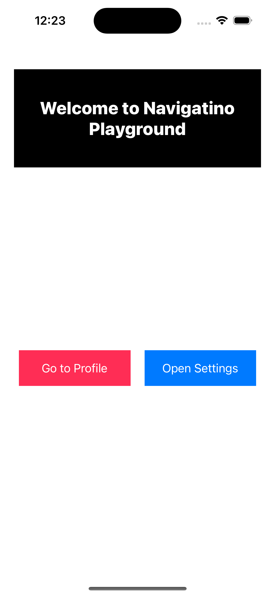

# PracticeNavigateBetweenScreens
# 🚀 Navigation Playground – UIKit Practice Project

Welcome to **Navigation Playground** – a mini iOS app created to practice screen navigation using UIKit, without passing any data between screens.

---

## 🧠 What’s Inside

This project focuses on **manual screen transitions** in UIKit using:
- `instantiateViewController` for navigating forward
- `dismiss()` for going back
- Storyboard setup with `Storyboard ID` + `Identity Inspector`

It’s all about **clean screen switching**, without shared data, just mastering the motion.

---

## 🧩 App Structure

The app contains **three screens**:

### 🟢 Home Screen (`HomeViewController`)
- Welcome label  
- Button: Go to Profile  
- Button: Open Settings  
➡️ Both buttons use `instantiateViewController` to navigate.

---

### 🔵 Profile Screen (`ProfileViewController`)
- Simple label  
- Button to go back using `dismiss()`

---

### 🟡 Settings Screen (`SettingsViewController`)
- Settings label  
- Button to close the screen using `dismiss()`

---

## 🛠️ Key Concepts Practiced

✅ Manual navigation in UIKit:
```swift
let vc = storyboard?.instantiateViewController(withIdentifier: "SettingsViewController") as! SettingsViewController
vc.modalPresentationStyle = .fullScreen
present(vc, animated: true)
```

---

## 🎥 Demo Video

[](./Demo/VideoRun.mp4)


